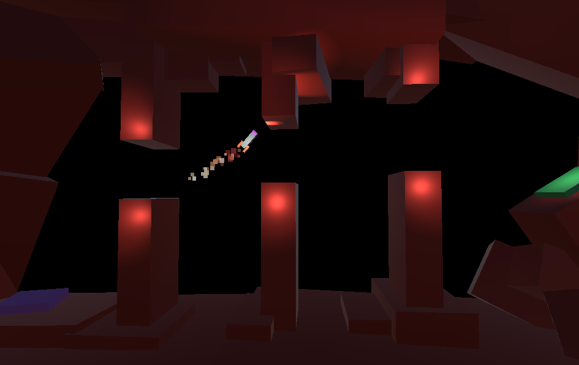

# Project Boost 🚀

 

Rocket ship arcade game in which the goal is to reach the landing site and not crash along the way.

## 🎮 How to play?

The game is available at the links below:

* [ShareMyGame](https://sharemygame.com/@JakubGalazka/project-boost)

* [SIMMER.io](https://simmer.io/@JakubGalazka/project-boost)

## References

* [Complete C# Unity Game Developer 3D](https://www.udemy.com/course/unitycourse2/)
